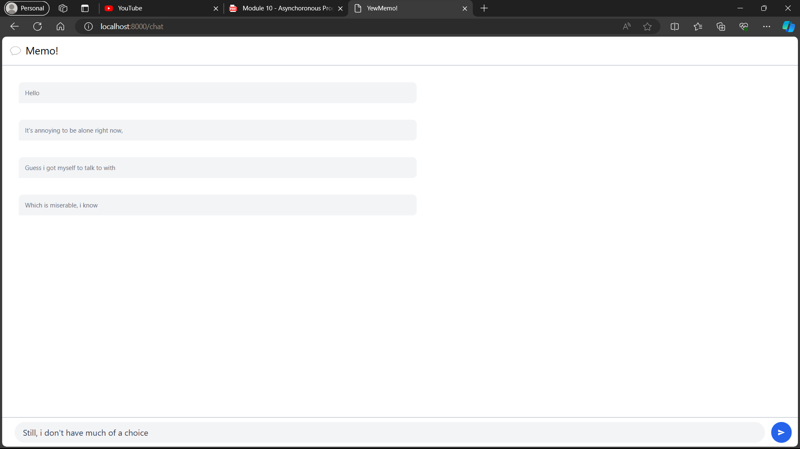

## Reflection
1. Original Code

2. Be Creative

Apa yang saya lakukan adalah mengubah YewChat menjadi YewMemo dengan memodifikasi bagian chat.rs. Yang saya lakukan pada dasarnya menghapus bagian html yang menampilkan detail daftar user, nama pengirim, dan avatar lalu mengubah fungsi submit message untuk memasukan semua pesan yang dimasukan oleh pengguna ke dalam messages dari bagia chat sehingga memo yang diketik oleh pengguna dapat dimunculkan.